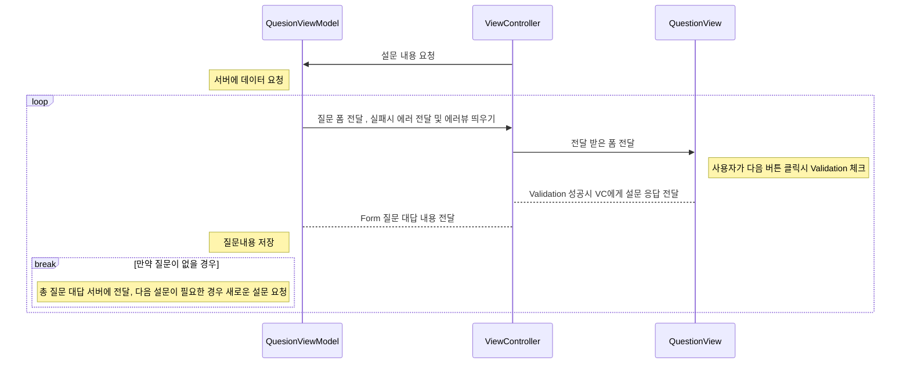

## 설명  
서버에서 설문조사에 필요한 정보를 받아와 정보를 토대로 UI를 그리고 입력 폼에 따라 알맞은 유효성 검사를 하고 문제가 없으면   
통해 입력한 내용을 서버에 보내주는 설문조사 앱입니다.    


## 시현 영상


## 파일 구조
```
├─ Subvey_Mission
│  ├─ Core // 가장 중요한 기능들을 모아놓은 디렉토리
│  │  ├─ Form // From 관련 기능들을 모아놓은 디렉토리
│  │  └─ Validate // 유효성 검사 관련 기능들을 모아놓은 디렉토리
│  │     ├─ ValidateError.swift
│  │     ├─ Validations // 각종 유효성 검사를 진행하는 클래스 디렉토리
│  │     └─ Validators // 유효성 검사를 모아서 작업 할 수 있도록 하는 클래스 디렉토리
│  ├─ Entity // 설문 조사 관련 데이터 디렉토리
│  ├─ Error // 네트워크 에러와 관련된 디렉토리
│  ├─ Network // 네트워크 작업 관련 디렉토리
│  ├─ Page
│  │  ├─ Home
│  │  │  └─ Controller
│  │  └─ Question
│  │     ├─ Controller
│  │     ├─ View // 설문 조사화면에 필요한 View의 디렉토리 ( 글자타입 설문 뷰, 체크타입 설문 뷰 등등 )
│  │     └─ ViewModel
│  └─ Utils // 각종 도움을 주는 함수와 클래스 디렉토리
│     └─ Extension
├─ doc // 구현 설명 문서 디렉토리
└─ mock // API Json 파일 디렉토리
```
## 로직


## API
Postman의 목업 서버를 사용하여 구현함   
[기본설문조사 API URL](https://512ab7c7-e29e-4a64-ace6-d1e98a5ce40f.mock.pstmn.io/api/question/common)   
[추가설문조사 API URL](https://512ab7c7-e29e-4a64-ace6-d1e98a5ce40f.mock.pstmn.io/api/question/1)

## 구현
- [애니메이션을 통한 화면전환](https://github.com/three523/Subvey_mission/blob/main/doc/%ED%99%94%EB%A9%B4%EC%A0%84%ED%99%98%EA%B8%B0%EB%8A%A5%EA%B5%AC%ED%98%84.md)
- Json 형식에 따라 다른 UI가 보이도록 구현
- [Validation 기능 구현](https://github.com/three523/Subvey_mission/blob/main/doc/Validation_%EA%B8%B0%EB%8A%A5%EA%B5%AC%ED%98%84.md)
Json에는 Form 별로 여러개의 유효성 검사를 해줄 필요가 있다.    
예를 들면 이메일을 입력하는 설문 폼의 경우엔 이름이 비어있을 경우 체크와 2글자 이상인지 체크를 해줄 필요가 있다.    
각 Form에 맞는 View안에 Validation이 맞는지 체크하는 클래스를 배열로 만들어두고 다음 질문 버튼 클릭시 모든 유효성 검사를 실행하도록 구현    
아래는 예시코드
```swift
for validation in validations {
  if validate.type == "not" {
      switch validate.target {
      case .string(let compareValue):
          let notEqualValidate = NotEqualValidation(fieldName: form.name, compareValue: compareValue, error: error)
          formValidator.add(validate: notEqualValidate)
      default:
          print("잘못된 ValidateTarget 입니다.\(validate.target)")
          break
      }
  } else if validate.type == "pattern" {
      switch validate.target {
      case .string(let pattern):
          let patternValidate = CustomValidation(fieldName: form.name, pattern: pattern, error: error)
          formValidator.add(validate: patternValidate)
      default:
          print("잘못된 ValidateTarget 입니다.\(validate.target)")
          break
      }
  }
```
이런식으로 해야할 유효성 검사들을 모아놓고
```swift
formValidator.validate(input: answerTextField.text ?? "")
```
validate를 해주면 모든 유효성 검사를 진행하게 된다.
만약 nil이 반환 될경우 다음 질문으로 넘어가고    
아닐 경우 Validation에 들어가있는 error가 실행되도록 구현되어있다.

## 아쉬웠던점
일단 다양한 타입이 올 수 있다는 것이 디코딩 작업을 하는 것도 생각보다 복잡하다고 느껴졌다.    
또한 각자 타입에 맞는 Validate를 해주고 다시 그려야 하다보니 굉장히 많은 조건문이 생기는 문제가 발생했다.    
Validation을 생성 하는 것은 팩토리 패턴으로 어떻게 구현할 수 있을지 고민을 하고 있는 중이다.    

또한 라이브러리를 따라하지 않으려고 억지로 뷰안에 Validator를 넣어서 뷰안에서 Validate를 하는 작업을 하였는데 좋지 않은 방법이였다.    
뷰 안에서는 값만 가지고 있고 그 값을 ViewController에서 버튼 클릭시 가져오는 방식으로 구현 했으면 View안에서는 뷰 전환만 하는 방법이 있었지 않을까 싶다.    
