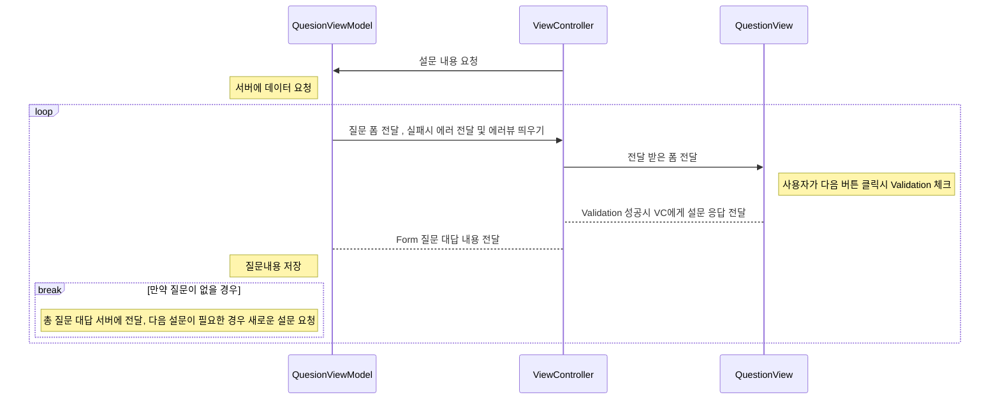

## 설명
- 주류 설문 조사 앱   
서버에서 설문조사에 필요한 정보를 받아와 정보를 토대로 UI를 그리고 입력 폼에 따라 알맞은 Validation을 통해 입력한 내용을 서버에 보내주는 설문조사 앱입니다.    


## 시현 영상


## 로직


## API
Postman의 목업 서버를 사용하여 구현함   
[기본설문조사 API URL](https://512ab7c7-e29e-4a64-ace6-d1e98a5ce40f.mock.pstmn.io/api/question/common)   
[추가설문조사 API URL](https://512ab7c7-e29e-4a64-ace6-d1e98a5ce40f.mock.pstmn.io/api/question/1)

json 형식
```json
{
    "status": 200,
    "data": {
        "forms": [
            {
                "name": "name",
                "question": "이름을 입력해주세요.",
                "required": true,
                "type": "text",
                "placeholder": "이름",
                "validate": [
                    {
                        "type": "not",
                        "target": "",
                        "validateText": "이름을 입력해주세요."
                    },
                    {
                        "type": "minMaxLength",
                        "target": [2, "-"],
                        "validateText": "이름을 2글자 이상 입력해주세요."
                    }
                ]
            },
            {
                "name": "email",
                "question": "이메일을 입력해주세요.",
                "required": true,
                "type": "text",
                "placeholder": "000@gmail.com",
                "validate": [
                    {
                        "type": "not",
                        "target": "",
                        "validateText": "이메일을 입력해주세요."
                    },
                    {
                        "type": "pattern",
                        "target": "^([\\w\\.\\_\\-])*[a-zA-Z0-9]+([\\w\\.\\_\\-])*([a-zA-Z0-9])+([\\w\\.\\_\\-])+@([a-zA-Z0-9]+\\.)+[a-zA-Z0-9]{2,8}$",
                        "validateText": "이메일 주소 형식이 올바르지 않습니다."
                    }
                ]
            },
            {
                "name": "age",
                "question": "나이를 입력해주세요.",
                "required": true,
                "type": "number",
                "placeholder": 0,
                "validate": [
                    {
                        "type": "not",
                        "target": 0,
                        "validateText": "나이를 입력해주세요."
                    }
                ]
            },
            {
                "name": "like",
                "question": "술을 얼마나 좋아하십니까?",
                "required": true,
                "type": "radioNumber",
                "placeholder": 0,
                "validate": [

                ]
            }
        ],
        "escapeValidate": [
            {
               "name": "age",
               "type": "minMax",
               "target": [19, "-"]
            }
        ]
    }
}
```

## 구현
Json에는 Form 별로 여러개의 유효성 검사를 해줄 필요가 있다.    
예를 들면 이메일을 입력하는 설문 폼의 경우엔 이름이 비어있을 경우 체크와 2글자 이상인지 체크를 해줄 필요가 있다.    
각 Form에 맞는 View안에 Validation이 맞는지 체크하는 클래스를 배열로 만들어두고 다음 질문 버튼 클릭시 모든 유효성 검사를 실행하도록 구현    
아래는 예시코드
```swift
for validation in validations {
  if validate.type == "not" {
      switch validate.target {
      case .string(let compareValue):
          let notEqualValidate = NotEqualValidation(fieldName: form.name, compareValue: compareValue, error: error)
          formValidator.add(validate: notEqualValidate)
      default:
          print("잘못된 ValidateTarget 입니다.\(validate.target)")
          break
      }
  } else if validate.type == "pattern" {
      switch validate.target {
      case .string(let pattern):
          let patternValidate = CustomValidation(fieldName: form.name, pattern: pattern, error: error)
          formValidator.add(validate: patternValidate)
      default:
          print("잘못된 ValidateTarget 입니다.\(validate.target)")
          break
      }
  }
```
이런식으로 해야할 유효성 검사들을 모아놓고
```swift
formValidator.validate(input: answerTextField.text ?? "")
```
validate를 해주면 모든 유효성 검사를 진행하게 된다.
만약 nil이 반환 될경우 다음 질문으로 넘어가고    
아닐 경우 Validation에 들어가있는 error가 실행되도록 구현되어있다.
